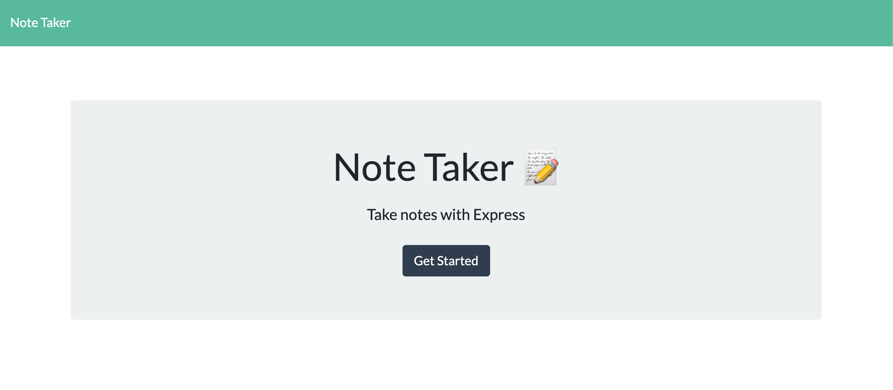
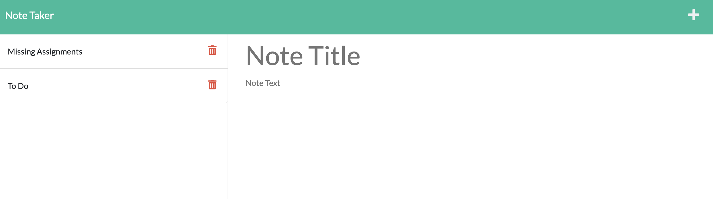
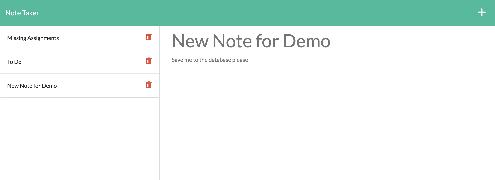

# Note Taker APP

* App uses Express in order to add new notes to a database from the browser.
* GET and POST routes allow users read and update notes in the app.
* The new Notes stay in the database and are visible on the left hadn sid eof the application.
* Future development of the app will allow users to delte notes.

* [Link to Deployed App](https://note-taker-application-vr.herokuapp.com/)

